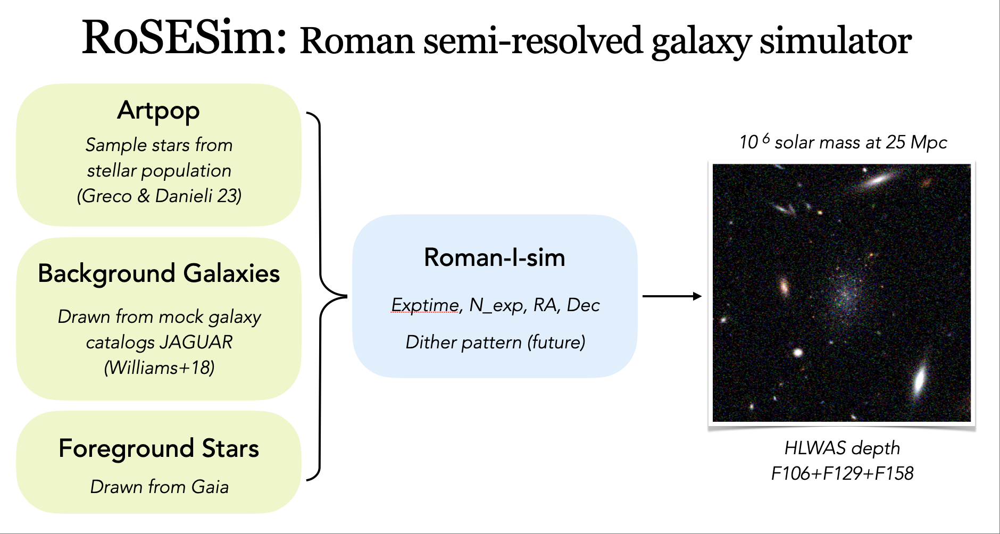

# RoSE-Sim: Roman semi-resolved galaxy simulator

A Python package for image simulations of semi-resolved dwarf galaxies for Roman

<!-- insert demo.png  -->


## Installation

You can install locally with:
```bash
pip install -e .
```
You need to set `ROSESIM_DATA_PATH` in your environment variables, e.g., add `export ROSESIM_DATA_PATH=/scratch/gpfs/JENNYG/jiaxuanl/Data/SBF/Rosesim/` to `.bashrc`.

You also need to download the [JAGUAR](https://fenrir.as.arizona.edu/jaguar/download_jaguar_files.html) catalog to make background sky image. Just put the catalog files in the `ROSESIM_DATA_PATH` directory, such as `ROSESIM_DATA_PATH/JAGUAR/JADES_all_mock_r1_v1.2.fits`. If you wanna use other catalogs for background galaxies, take a look at the `RomanSky.load_jaguar_bkg` function!

## Usage

Run as a script:
```bash
rosesim_sky --obs_ra=150.1049 --obs_dec=2.2741 --size=5001 --prefix='sky_jaguar_trilegal' --exptime=642 --filters="['F106', 'F129', 'F158']" --seed=42 --include_bkg=True --include_star=True --exptime=642

rosesim_gal --obs_ra=150.1049 --obs_dec=2.2741 --distance=5 --age=1.0 --log_m_star=4 --exptime=642
```


Reading a simulated image and write it to fits:
```python
import rosesim

dm = rosesim.read_L3_asdf('./F158_642s.asdf')
dm.write_fits('./F158_642s.fits')
```


## Requirements
- numpy
- matplotlib
- astropy
- astroquery
- romanisim
- artpop
- asdf
- roman_datamodels

## License
MIT

## Future plans
- Add stellar population information to the `meta` of ASDF
